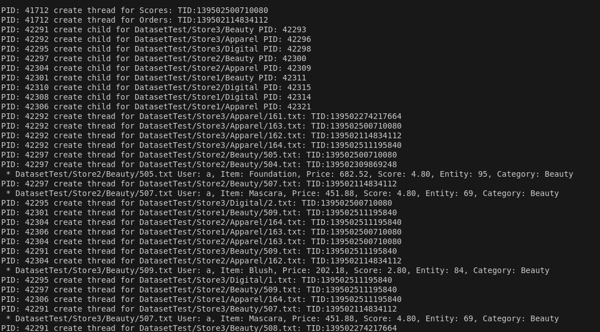
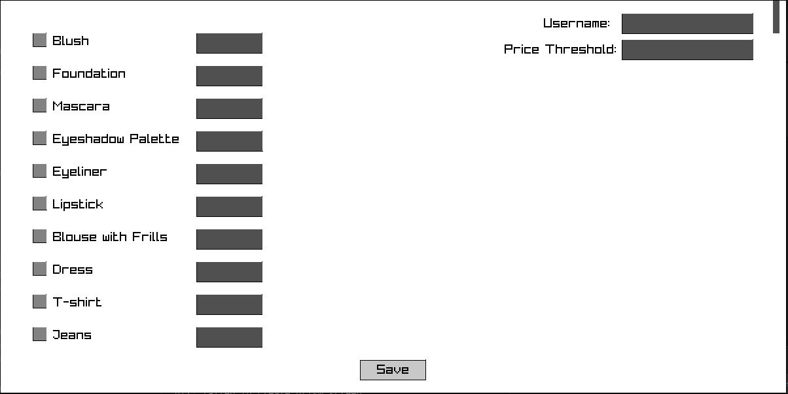
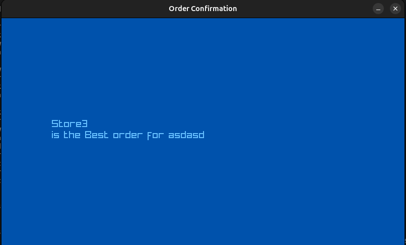
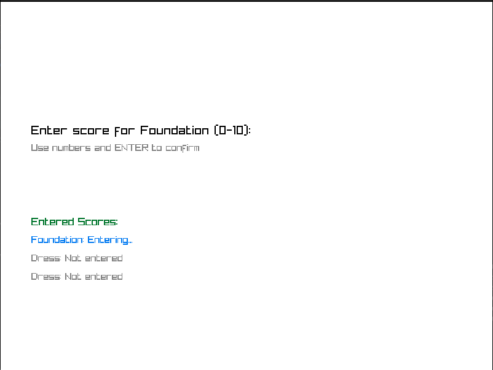

# Multi-Thread-**Shopping**

## Overview

This project implements a sophisticated distributed shopping pipeline system that allows multiple users to search, compare, and order items across different stores using multi-process and multi-threaded programming techniques in C.

## System Architecture

Architectures that was used:
- **Message Queues**
- **Shared Memory**
- **Multi-Processing**
- **Multi-Threading**
- **Inter-Process Communication (IPC)**
- **Mutex Lock**
- **Semaphore**

### Key **Components**



#### 1. Main Process
- Manages user input and overall system flow
- Creates shared memory for inter-process communication
- Handles **multiple** user sessions
- **Forks child processes for each user**

#### 2. User Process
 - Handles the entire shopping workflow for user:
- Explores stores
- Create a process for each Store in the dataset
- creates a thread for Orders
- creates a thread for Scores
- creates a thread for Final
- creates a message queue for IPC



#### 3. Order Thread
 - Receives shopping lists using **Message Queues**
 - locks the message queue
 - Calculates total value for stores shopping lists
 - Calculates total price for stores shopping lists
 - Finds Best Shopping list based on stores total value and price
 - Gives a discount to user if Its not the users first purchase of that store

#### 4. Final Thread
 - Finalizes the order based on users's price threshold
 - Selects the store with most value from those that user can buy from (total price less than user's price threshold)
 - Shows the total price
 - Updates the item files using the Threads using **Shared Memory**



#### 5. Scores Thread
 - Gets Scores for items from users and send them for threads that read items from files to update them
 - Updates last modified time for items that have changed



#### 6. Store Process
 - Finds Category subdirs
 - Creates a process for each Category

#### 7. Category Process
 - Finds items subdirs
 - **Creates a Thread** for each Item
 - Finds user index 
 - Waits for Threads to finish their calculations and opens a **Message Queue** and sends shopping lists

#### 8. Item Thread
 - Locks the files
 - Processes item `reads item data` `create a Item struct`
 - Creates a log file for each item based on `userID and OrderID`
 - After processing, It waits for the shared memory and reads from it when Final Thread sends messages
---
## Key Functionalities

1. **User Order Processing**
   - Users can input multiple orders
   - System searches across stores for available items
   - Compares items based on price, score, and availability

2. **Dynamic Item Selection**
   - Explores items in multiple stores and categories
   - Filters items based on user's order list
   - Considers item entity (stock) and score

3. **Store Comparison**
   - Calculates total price and value for each shopping list
   - Applies discounts for shopping lists that user bought recently from same store
   - Selects the best shopping list based on user's price threshold

4. **Score and Entity Management**
   - Allows users to rate purchased items
   - Updates item scores dynamically 
   updated_score = (0.75 * old_score + 0.25 * new_score)
   - Reduces item entities after purchase
---
## Synchronization and Communication

### Shared Memory
- Stores thread messages
- Enables communication between processes
- Allows updating item paths and counts

### Message Queues
- Facilitates communication between different process stages
- Sends item information between exploration and order processing stages

### Atomic Locks
- Ensures thread-safe operations
- Protects critical sections during score updates, entity modifications, and order processing

## Workflow

1. User inputs order details
2. System forks processes for each user
3. Explores stores and categories concurrently
4. Matches items with user's order list
5. Compares and selects best shopping list
6. Updates item entities and scores
7. Finalizes order for users

## Compilation
run `bash compile.sh` to compile

`compile.sh`:
```bash
c_files=$(find . -name "*.c" ! -name "test.c")
sudo gcc -o main.out -w $c_files -pthread -lraylib -lGL -lm -lpthread -ldl -lX11
```

## Reset Dataset
run `bash clearDataset.sh` to clear dataset from `log` files

`clearDataset.sh`:
```bash
log_files=$(find ./Dataset/ -name "*.log")
rm -rf $log_files
```